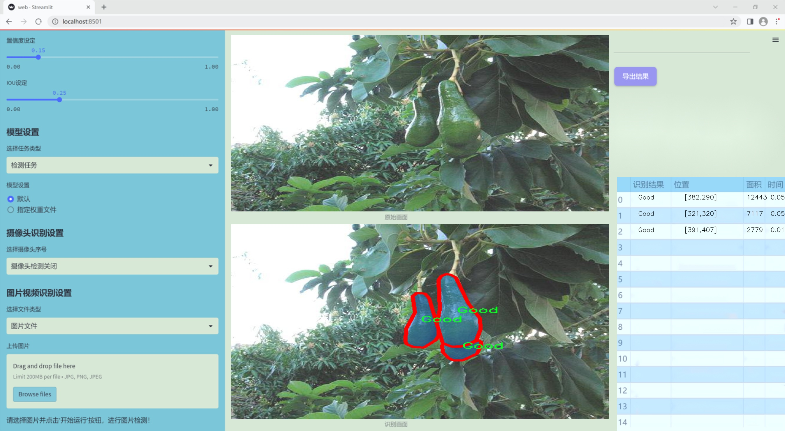
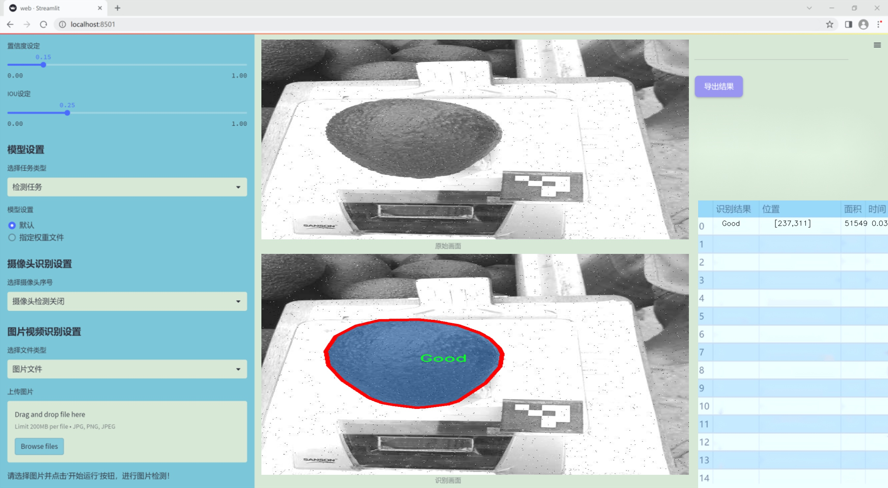
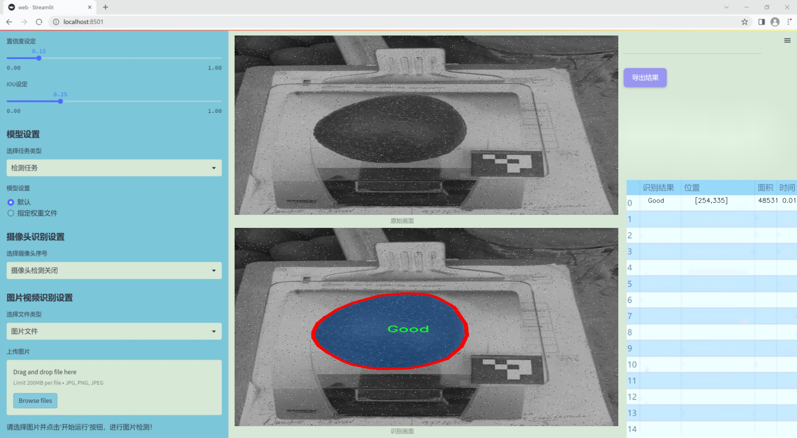
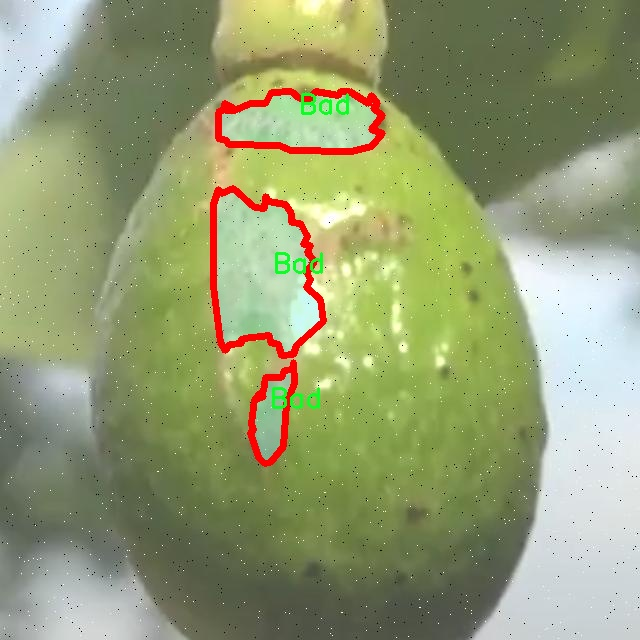
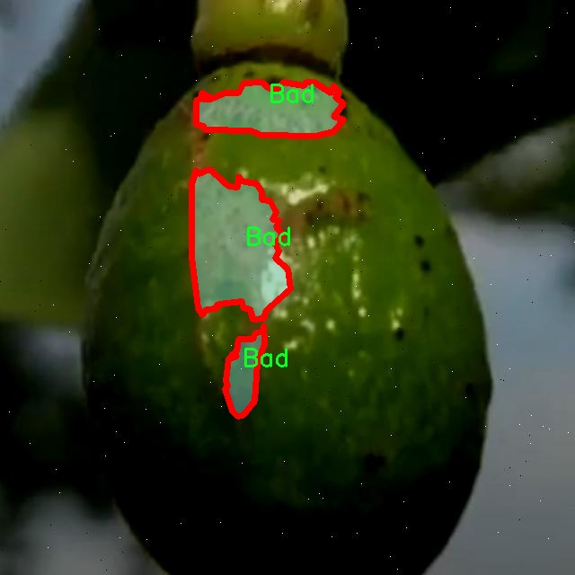
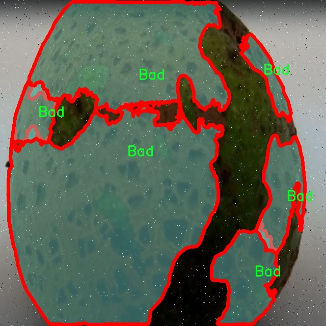
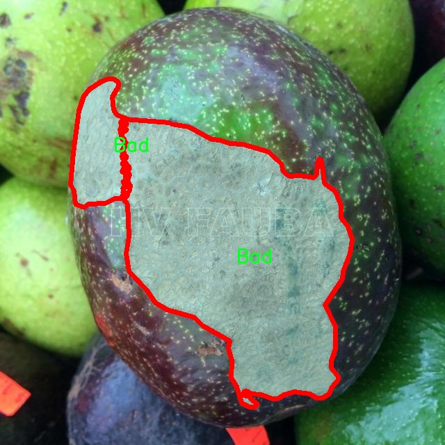
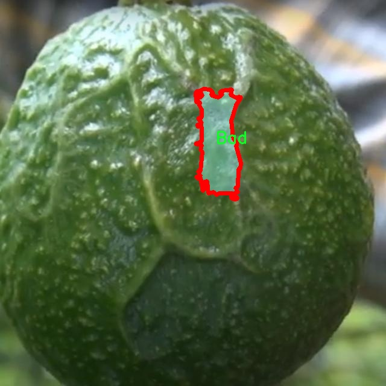

### 1.背景意义

研究背景与意义

随着全球农业生产的不断发展，农产品的质量检测变得愈发重要。尤其是在水果和蔬菜的生产与销售中，表面缺陷的检测直接影响到产品的市场价值和消费者的购买决策。鳄梨作为一种受欢迎的健康食品，其表面缺陷的检测不仅关乎食品安全，还涉及到消费者的体验和生产者的经济利益。因此，开发高效、准确的鳄梨表面缺陷检测系统具有重要的现实意义。

近年来，深度学习技术在计算机视觉领域取得了显著进展，尤其是目标检测和图像分割任务中。YOLO（You Only Look Once）系列模型因其高效性和实时性，成为了目标检测的主流方法之一。针对鳄梨表面缺陷的检测，基于改进YOLOv11的图像分割系统能够有效地识别和分类鳄梨的表面状态，包括“好”、“坏”和“未定义”三类。这种分类不仅能够帮助生产者及时发现和处理不合格产品，还能提高消费者对产品质量的信任度。

本研究将使用包含1600张图像的数据集，经过精心标注和预处理，确保了数据的多样性和代表性。通过对图像进行增强处理，如随机亮度调整和高斯模糊，能够进一步提升模型的鲁棒性和泛化能力。此外，针对不同类别的鳄梨表面状态，系统将实现精准的实例分割，为后续的自动化检测和质量控制提供有力支持。

综上所述，基于改进YOLOv11的鳄梨表面缺陷检测图像分割系统不仅具有重要的学术价值，还在实际应用中展现出广阔的前景。通过该系统的研发与应用，能够有效提升鳄梨的质量检测效率，推动农业生产的智能化发展，为食品安全和消费者权益的保障做出贡献。

### 2.视频效果

[2.1 视频效果](https://www.bilibili.com/video/BV13QqzYwELS/)

### 3.图片效果







##### [项目涉及的源码数据来源链接](https://kdocs.cn/l/cszuIiCKVNis)**

注意：本项目提供训练的数据集和训练教程,由于版本持续更新,暂不提供权重文件（best.pt）,请按照6.训练教程进行训练后实现上图演示的效果。

### 4.数据集信息

##### 4.1 本项目数据集类别数＆类别名

nc: 3
names: ['Bad', 'Good', 'undefined']


该项目为【图像分割】数据集，请在【训练教程和Web端加载模型教程（第三步）】这一步的时候按照【图像分割】部分的教程来训练

##### 4.2 本项目数据集信息介绍

本项目数据集信息介绍

本项目旨在改进YOLOv11模型，以实现对鳄梨表面缺陷的高效检测与图像分割。为此，我们构建了一个专门的数据集，主题为“Detection avocado”，该数据集包含了多样化的鳄梨图像，涵盖了不同的生长环境、光照条件和拍摄角度，以确保模型的泛化能力和准确性。数据集中包含三种主要类别，分别为“Bad”（不良）、“Good”（良好）和“undefined”（未定义），这些类别的划分为模型的训练提供了清晰的标注，便于后续的分类与分割任务。

在数据收集过程中，我们从多个来源获取了大量的鳄梨图像，确保样本的多样性和代表性。每个类别的图像数量经过精心设计，以保证模型在训练时能够学习到足够的特征信息。例如，“Bad”类别的图像展示了各种表面缺陷，如黑斑、皱缩和腐烂等，而“Good”类别则包含了完好无损的鳄梨图像，这些图像在色彩、纹理和形状上具有一致性。至于“undefined”类别，则用于处理那些难以明确分类的图像，这一类别的存在使得模型在面对模糊或不清晰的图像时能够保持一定的鲁棒性。

数据集的构建不仅注重图像的数量，更加重视图像的质量与标注的准确性。每张图像都经过专业人员的仔细审核与标注，确保每个类别的定义清晰且一致。此外，数据集还包含了多种背景和环境因素，以模拟实际应用场景中可能遇到的各种情况。通过这种方式，我们希望训练出的YOLOv11模型能够在实际应用中实现高效、准确的鳄梨表面缺陷检测，为农业生产和质量控制提供有力支持。











### 5.全套项目环境部署视频教程（零基础手把手教学）

[5.1 所需软件PyCharm和Anaconda安装教程（第一步）](https://www.bilibili.com/video/BV1BoC1YCEKi/?spm_id_from=333.999.0.0&vd_source=bc9aec86d164b67a7004b996143742dc)


[5.2 安装Python虚拟环境创建和依赖库安装视频教程（第二步）](https://www.bilibili.com/video/BV1ZoC1YCEBw?spm_id_from=333.788.videopod.sections&vd_source=bc9aec86d164b67a7004b996143742dc)

### 6.改进YOLOv11训练教程和Web_UI前端加载模型教程（零基础手把手教学）

[6.1 改进YOLOv11训练教程和Web_UI前端加载模型教程（第三步）](https://www.bilibili.com/video/BV1BoC1YCEhR?spm_id_from=333.788.videopod.sections&vd_source=bc9aec86d164b67a7004b996143742dc)


按照上面的训练视频教程链接加载项目提供的数据集，运行train.py即可开始训练



     Epoch   gpu_mem       box       obj       cls    labels  img_size
     1/200     20.8G   0.01576   0.01955  0.007536        22      1280: 100%|██████████| 849/849 [14:42<00:00,  1.04s/it]
               Class     Images     Labels          P          R     mAP@.5 mAP@.5:.95: 100%|██████████| 213/213 [01:14<00:00,  2.87it/s]
                 all       3395      17314      0.994      0.957      0.0957      0.0843

     Epoch   gpu_mem       box       obj       cls    labels  img_size
     2/200     20.8G   0.01578   0.01923  0.007006        22      1280: 100%|██████████| 849/849 [14:44<00:00,  1.04s/it]
               Class     Images     Labels          P          R     mAP@.5 mAP@.5:.95: 100%|██████████| 213/213 [01:12<00:00,  2.95it/s]
                 all       3395      17314      0.996      0.956      0.0957      0.0845

     Epoch   gpu_mem       box       obj       cls    labels  img_size
     3/200     20.8G   0.01561    0.0191  0.006895        27      1280: 100%|██████████| 849/849 [10:56<00:00,  1.29it/s]
               Class     Images     Labels          P          R     mAP@.5 mAP@.5:.95: 100%|███████   | 187/213 [00:52<00:00,  4.04it/s]
                 all       3395      17314      0.996      0.957      0.0957      0.0845


###### [项目数据集下载链接](https://kdocs.cn/l/cszuIiCKVNis)

### 7.原始YOLOv11算法讲解

YOLOv11是Ultralytics推出的YOLO系列最新版本，专为实现尖端的物体检测而设计。其架构和训练方法上进行了重大改进，使之不仅具备卓越的准确性和处理速度，还在计算效率上实现了一场革命。得益于其改进的主干和颈部架构，YOLOv11在特征提取和处理复杂任务时表现更加出色。在2024年9月27日，Ultralytics通过长达九小时的在线直播发布这一新作，展示了其在计算机视觉领域的革新。

YOLOv11通过精细的架构设计和优化训练流程，在保持高精度的同时，缩减了参数量，与YOLOv8m相比减少了22%的参数，使其在COCO数据集上的平均准确度（mAP）有所提升。这种效率的提高使YOLOv11非常适合部署在各种硬件环境中，包括边缘设备、云计算平台以及支持NVIDIA GPU的系统，确保在灵活性上的优势。

该模型支持广泛的任务，从对象检测、实例分割到图像分类、姿态估计和定向对象检测（OBB），几乎覆盖了计算机视觉的所有主要挑战。其创新的C3k2和C2PSA模块提升了网络深度和注意力机制的应用，提高了特征提取的效率和效果。同时，YOLOv11的改进网络结构也使之在复杂视觉任务上得以从容应对，成为各类计算机视觉任务的多功能选择。这些特性令YOLOv11在实施实时物体检测的各个领域中表现出众。
* * *

2024年9月27日，Ultralytics在线直播长达九小时，为YOLO11召开“发布会”

YOLO11 是 Ultralytics YOLO 系列实时物体检测器的最新版本，它以尖端的准确性、速度和效率重新定义了可能性。在之前 YOLO
版本的显著进步的基础上，YOLO11 在架构和训练方法方面进行了重大改进，使其成为各种计算机视觉任务的多功能选择。


##### YOLO11主要特点：

  * 增强的特征提取：YOLO11 采用了改进的主干和颈部架构，增强了特征提取能力，可实现更精确的对象检测和复杂任务性能。
  * 针对效率和速度进行了优化：YOLO11 引入了完善的架构设计和优化的训练流程，可提供更快的处理速度，并在准确度和性能之间保持最佳平衡。
  * 更少的参数，更高的准确度：借助模型设计的进步，YOLO11m 在 COCO 数据集上实现了更高的平均准确度 (mAP)，同时使用的参数比 YOLOv8m 少 22%，从而提高了计算效率，同时又不影响准确度。
  * 跨环境的适应性：YOLO11 可以无缝部署在各种环境中，包括边缘设备、云平台和支持 NVIDIA GPU 的系统，从而确保最大的灵活性。
  * 支持的任务范围广泛：无论是对象检测、实例分割、图像分类、姿势估计还是定向对象检测 (OBB)，YOLO11 都旨在满足各种计算机视觉挑战。

##### 支持的任务和模式

YOLO11 以 YOLOv8 中引入的多功能模型系列为基础，为各种计算机视觉任务提供增强的支持：

Model| Filenames| Task| Inference| Validation| Training| Export  
---|---|---|---|---|---|---  
YOLO11| yolol11n.pt, yolol11s.pt, yolol11m.pt, yolol11x.pt| Detection| ✅| ✅|
✅| ✅  
YOLO11-seg| yolol11n-seg.pt, yolol11s-seg.pt, yolol11m-seg.pt,
yolol11x-seg.pt| Instance Segmentation| ✅| ✅| ✅| ✅  
YOLO11-pose| yolol11n-pose.pt, yolol11s-pose.pt, yolol11m-pose.pt,
yolol11x-pose.pt| Pose/Keypoints| ✅| ✅| ✅| ✅  
YOLO11-obb| yolol11n-obb.pt, yolol11s-obb.pt, yolol11m-obb.pt,
yolol11x-obb.pt| Oriented Detection| ✅| ✅| ✅| ✅  
YOLO11-cls| yolol11n-cls.pt, yolol11s-cls.pt, yolol11m-cls.pt,
yolol11x-cls.pt| Classification| ✅| ✅| ✅| ✅  
  
##### 简单的 YOLO11 训练和推理示例

以下示例适用于用于对象检测的 YOLO11 Detect 模型。

    
    
    from ultralytics import YOLO
    
    # Load a model
    model = YOLO("yolo11n.pt")
    
    # Train the model
    train_results = model.train(
        data="coco8.yaml",  # path to dataset YAML
        epochs=100,  # number of training epochs
        imgsz=640,  # training image size
        device="cpu",  # device to run on, i.e. device=0 or device=0,1,2,3 or device=cpu
    )
    
    # Evaluate model performance on the validation set
    metrics = model.val()
    
    # Perform object detection on an image
    results = model("path/to/image.jpg")
    results[0].show()
    
    # Export the model to ONNX format
    path = model.export(format="onnx")  # return path to exported model

##### 支持部署于边缘设备

YOLO11 专为适应各种环境而设计，包括边缘设备。其优化的架构和高效的处理能力使其适合部署在边缘设备、云平台和支持 NVIDIA GPU
的系统上。这种灵活性确保 YOLO11 可用于各种应用，从移动设备上的实时检测到云环境中的复杂分割任务。有关部署选项的更多详细信息，请参阅导出文档。

##### YOLOv11 yaml文件

    
    
    # Ultralytics YOLO 🚀, AGPL-3.0 license
    # YOLO11 object detection model with P3-P5 outputs. For Usage examples see https://docs.ultralytics.com/tasks/detect
    
    # Parameters
    nc: 80 # number of classes
    scales: # model compound scaling constants, i.e. 'model=yolo11n.yaml' will call yolo11.yaml with scale 'n'
      # [depth, width, max_channels]
      n: [0.50, 0.25, 1024] # summary: 319 layers, 2624080 parameters, 2624064 gradients, 6.6 GFLOPs
      s: [0.50, 0.50, 1024] # summary: 319 layers, 9458752 parameters, 9458736 gradients, 21.7 GFLOPs
      m: [0.50, 1.00, 512] # summary: 409 layers, 20114688 parameters, 20114672 gradients, 68.5 GFLOPs
      l: [1.00, 1.00, 512] # summary: 631 layers, 25372160 parameters, 25372144 gradients, 87.6 GFLOPs
      x: [1.00, 1.50, 512] # summary: 631 layers, 56966176 parameters, 56966160 gradients, 196.0 GFLOPs
    
    # YOLO11n backbone
    backbone:
      # [from, repeats, module, args]
      - [-1, 1, Conv, [64, 3, 2]] # 0-P1/2
      - [-1, 1, Conv, [128, 3, 2]] # 1-P2/4
      - [-1, 2, C3k2, [256, False, 0.25]]
      - [-1, 1, Conv, [256, 3, 2]] # 3-P3/8
      - [-1, 2, C3k2, [512, False, 0.25]]
      - [-1, 1, Conv, [512, 3, 2]] # 5-P4/16
      - [-1, 2, C3k2, [512, True]]
      - [-1, 1, Conv, [1024, 3, 2]] # 7-P5/32
      - [-1, 2, C3k2, [1024, True]]
      - [-1, 1, SPPF, [1024, 5]] # 9
      - [-1, 2, C2PSA, [1024]] # 10
    
    # YOLO11n head
    head:
      - [-1, 1, nn.Upsample, [None, 2, "nearest"]]
      - [[-1, 6], 1, Concat, [1]] # cat backbone P4
      - [-1, 2, C3k2, [512, False]] # 13
    
      - [-1, 1, nn.Upsample, [None, 2, "nearest"]]
      - [[-1, 4], 1, Concat, [1]] # cat backbone P3
      - [-1, 2, C3k2, [256, False]] # 16 (P3/8-small)
    
      - [-1, 1, Conv, [256, 3, 2]]
      - [[-1, 13], 1, Concat, [1]] # cat head P4
      - [-1, 2, C3k2, [512, False]] # 19 (P4/16-medium)
    
      - [-1, 1, Conv, [512, 3, 2]]
      - [[-1, 10], 1, Concat, [1]] # cat head P5
      - [-1, 2, C3k2, [1024, True]] # 22 (P5/32-large)
    
      - [[16, 19, 22], 1, Detect, [nc]] # Detect(P3, P4, P5)
    

**YOLO11和YOLOv8 yaml文件的区别**


##### 改进模块代码

  * C3k2 

    
    
    class C3k2(C2f):
        """Faster Implementation of CSP Bottleneck with 2 convolutions."""
    
        def __init__(self, c1, c2, n=1, c3k=False, e=0.5, g=1, shortcut=True):
            """Initializes the C3k2 module, a faster CSP Bottleneck with 2 convolutions and optional C3k blocks."""
            super().__init__(c1, c2, n, shortcut, g, e)
            self.m = nn.ModuleList(
                C3k(self.c, self.c, 2, shortcut, g) if c3k else Bottleneck(self.c, self.c, shortcut, g) for _ in range(n)
            )

C3k2，它是具有两个卷积的CSP（Partial Cross Stage）瓶颈架构的更快实现。

**类继承：**

  * `C3k2`继承自类`C2f`。这表明`C2f`很可能实现了经过修改的基本CSP结构，而`C3k2`进一步优化或修改了此结构。

**构造函数（`__init__`）：**

  * `c1`：输入通道。

  * `c2`：输出通道。

  * `n`：瓶颈层数（默认为1）。

  * `c3k`：一个布尔标志，确定是否使用`C3k`块或常规`Bottleneck`块。

  * `e`：扩展比率，控制隐藏层的宽度（默认为0.5）。

  * `g`：分组卷积的组归一化参数或组数（默认值为 1）。

  * `shortcut`：一个布尔值，用于确定是否在网络中包含快捷方式连接（默认值为 `True`）。

**初始化：**

  * `super().__init__(c1, c2, n, short-cut, g, e)` 调用父类 `C2f` 的构造函数，初始化标准 CSP 组件，如通道数、快捷方式、组等。

**模块列表（`self.m`）：**

  * `nn.ModuleList` 存储 `C3k` 或 `Bottleneck` 模块，具体取决于 `c3k` 的值。

  * 如果 `c3k` 为 `True`，它会初始化 `C3k` 模块。`C3k` 模块接收以下参数：

  * `self.c`：通道数（源自 `C2f`）。

  * `2`：这表示在 `C3k` 块内使用了两个卷积层。

  * `shortcut` 和 `g`：从 `C3k2` 构造函数传递。

  * 如果 `c3k` 为 `False`，则初始化标准 `Bottleneck` 模块。

`for _ in range(n)` 表示将创建 `n` 个这样的块。

**总结：**

  * `C3k2` 实现了 CSP 瓶颈架构，可以选择使用自定义 `C3k` 块（具有两个卷积）或标准 `Bottleneck` 块，具体取决于 `c3k` 标志。

  * C2PSA

    
    
    class C2PSA(nn.Module):
        """
        C2PSA module with attention mechanism for enhanced feature extraction and processing.
    
        This module implements a convolutional block with attention mechanisms to enhance feature extraction and processing
        capabilities. It includes a series of PSABlock modules for self-attention and feed-forward operations.
    
        Attributes:
            c (int): Number of hidden channels.
            cv1 (Conv): 1x1 convolution layer to reduce the number of input channels to 2*c.
            cv2 (Conv): 1x1 convolution layer to reduce the number of output channels to c.
            m (nn.Sequential): Sequential container of PSABlock modules for attention and feed-forward operations.
    
        Methods:
            forward: Performs a forward pass through the C2PSA module, applying attention and feed-forward operations.
    
        Notes:
            This module essentially is the same as PSA module, but refactored to allow stacking more PSABlock modules.
    
        Examples:
            >>> c2psa = C2PSA(c1=256, c2=256, n=3, e=0.5)
            >>> input_tensor = torch.randn(1, 256, 64, 64)
            >>> output_tensor = c2psa(input_tensor)
        """
    
        def __init__(self, c1, c2, n=1, e=0.5):
            """Initializes the C2PSA module with specified input/output channels, number of layers, and expansion ratio."""
            super().__init__()
            assert c1 == c2
            self.c = int(c1 * e)
            self.cv1 = Conv(c1, 2 * self.c, 1, 1)
            self.cv2 = Conv(2 * self.c, c1, 1)
    
            self.m = nn.Sequential(*(PSABlock(self.c, attn_ratio=0.5, num_heads=self.c // 64) for _ in range(n)))
    
        def forward(self, x):
            """Processes the input tensor 'x' through a series of PSA blocks and returns the transformed tensor."""
            a, b = self.cv1(x).split((self.c, self.c), dim=1)
            b = self.m(b)
            return self.cv2(torch.cat((a, b), 1))

`C2PSA` 模块是一个自定义神经网络层，带有注意力机制，用于增强特征提取和处理。

**类概述**

  * **目的：**

  * `C2PSA` 模块引入了一个卷积块，利用注意力机制来改进特征提取和处理。

  * 它使用一系列 `PSABlock` 模块，这些模块可能代表某种形式的位置自注意力 (PSA)，并且该架构旨在允许堆叠多个 `PSABlock` 层。

**构造函数（`__init__`）：**

  * **参数：**

  * `c1`：输入通道（必须等于 `c2`）。

  * `c2`：输出通道（必须等于 `c1`）。

  * `n`：要堆叠的 `PSABlock` 模块数量（默认值为 1）。

  * `e`：扩展比率，用于计算隐藏通道的数量（默认值为 0.5）。

  * **属性：**

  * `self.c`：隐藏通道数，计算为 `int(c1 * e)`。

  * `self.cv1`：一个 `1x1` 卷积，将输入通道数从 `c1` 减少到 `2 * self.c`。这为将输入分成两部分做好准备。

  * `self.cv2`：另一个 `1x1` 卷积，处理后将通道维度恢复回 `c1`。

  * `self.m`：一系列 `PSABlock` 模块。每个 `PSABlock` 接收 `self.c` 通道，注意头的数量为 `self.c // 64`。每个块应用注意和前馈操作。

**前向方法：**

  * **输入：**

  * `x`，输入张量。

  * **操作：**

  1. `self.cv1(x)` 应用 `1x1` 卷积，将输入通道大小从 `c1` 减小到 `2 * self.c`。

  2. 生成的张量沿通道维度分为两部分，`a` 和 `b`。

  * `a`：第一个 `self.c` 通道。

  * `b`：剩余的 `self.c` 通道。

  1. `b` 通过顺序容器 `self.m`，它是 `PSABlock` 模块的堆栈。这部分经过基于注意的处理。

  2. 处理后的张量 `b` 与 `a` 连接。

  3. `self.cv2` 应用 `1x1` 卷积，将通道大小恢复为 `c1`。

  * **输出：**

  * 应用注意和卷积操作后的变换后的张量。

**总结：**

  * **C2PSA** 是一个增强型卷积模块，它通过堆叠的 `PSABlock` 模块应用位置自注意力。它拆分输入张量，将注意力应用于其中一部分，然后重新组合并通过最终卷积对其进行处理。此结构有助于从输入数据中提取复杂特征。

##### 网络结构


### 8.200+种全套改进YOLOV11创新点原理讲解

#### 8.1 200+种全套改进YOLOV11创新点原理讲解大全

由于篇幅限制，每个创新点的具体原理讲解就不全部展开，具体见下列网址中的改进模块对应项目的技术原理博客网址【Blog】（创新点均为模块化搭建，原理适配YOLOv5~YOLOv11等各种版本）

[改进模块技术原理博客【Blog】网址链接](https://gitee.com/qunmasj/good)


#### 8.2 精选部分改进YOLOV11创新点原理讲解

###### 这里节选部分改进创新点展开原理讲解(完整的改进原理见上图和[改进模块技术原理博客链接](https://gitee.com/qunmasj/good)【如果此小节的图加载失败可以通过CSDN或者Github搜索该博客的标题访问原始博客，原始博客图片显示正常】



### 视觉transformer(ViT)简介
视觉transformer(ViT)最近在各种计算机视觉任务中证明了巨大的成功，并受到了相当多的关注。与卷积神经网络(CNNs)相比，ViT具有更强的全局信息捕获能力和远程交互能力，表现出优于CNNs的准确性，特别是在扩大训练数据大小和模型大小时[An image is worth 16x16 words: Transformers for image recognition at scale,Coatnet]。

尽管ViT在低分辨率和高计算领域取得了巨大成功，但在高分辨率和低计算场景下，ViT仍不如cnn。例如，下图(左)比较了COCO数据集上当前基于cnn和基于vit的一级检测器。基于vit的检测器(160G mac)和基于cnn的检测器(6G mac)之间的效率差距超过一个数量级。这阻碍了在边缘设备的实时高分辨率视觉应用程序上部署ViT。


左图:现有的基于vit的一级检测器在实时目标检测方面仍然不如当前基于cnn的一级检测器，需要的计算量多出一个数量级。本文引入了第一个基于vit的实时对象检测器来弥补这一差距。在COCO上，efficientvit的AP比efficientdet高3.8，而mac较低。与YoloX相比，efficient ViT节省67.2%的计算成本，同时提供更高的AP。

中:随着输入分辨率的增加，计算成本呈二次增长，无法有效处理高分辨率的视觉应用。

右图:高分辨率对图像分割很重要。当输入分辨率从1024x2048降低到512x1024时，MobileNetV2的mIoU减少12% (8.5 mIoU)。在不提高分辨率的情况下，只提高模型尺寸是无法缩小性能差距的。

ViT的根本计算瓶颈是softmax注意模块，其计算成本随输入分辨率的增加呈二次增长。例如，如上图(中)所示，随着输入分辨率的增加，vit- small[Pytorch image models. https://github.com/rwightman/ pytorch-image-models]的计算成本迅速显著大于ResNet-152的计算成本。

解决这个问题的一个直接方法是降低输入分辨率。然而，高分辨率的视觉识别在许多现实世界的计算机视觉应用中是必不可少的，如自动驾驶，医疗图像处理等。当输入分辨率降低时，图像中的小物体和精细细节会消失，导致目标检测和语义分割性能显著下降。

上图(右)显示了在cityscape数据集上不同输入分辨率和宽度乘法器下MobileNetV2的性能。例如，将输入分辨率从1024x2048降低到512x1024会使cityscape的性能降低12% (8.5 mIoU)。即使是3.6倍高的mac，只放大模型尺寸而不增加分辨率也无法弥补这一性能损失。

除了降低分辨率外，另一种代表性的方法是限制softmax注意，方法是将其范围限制在固定大小的局部窗口内[Swin transformer,Swin transformer v2]或降低键/值张量的维数[Pyramid vision transformer,Segformer]。然而，它损害了ViT的非局部注意能力，降低了全局接受域(ViT最重要的优点)，使得ViT与大内核cnn的区别更小[A convnet for the 2020s,Scaling up your kernels to 31x31: Revisiting large kernel design in cnns,Lite pose: Efficient architecture design for 2d human pose estimation]。

本文介绍了一个有效的ViT体系结构，以解决这些挑战。发现没有必要坚持softmax注意力。本文建议用线性注意[Transformers are rnns: Fast autoregressive transformers with linear attention]代替softmax注意。

线性注意的关键好处是，它保持了完整的n 2 n^2n 2
 注意映射，就像softmax注意。同时，它利用矩阵乘法的联想特性，避免显式计算完整的注意映射，同时保持相同的功能。因此，它保持了softmax注意力的全局特征提取能力，且计算复杂度仅为线性。线性注意的另一个关键优点是它避免了softmax，这使得它在移动设备上更有效(下图左)。


左图:线性注意比类似mac下的softmax注意快3.3-4.5倍，这是因为去掉了硬件效率不高的softmax功能。延迟是在Qualcomm Snapdragon 855 CPU和TensorFlow-Lite上测量的。本文增加线性注意的头部数量，以确保它具有与softmax注意相似的mac。

中:然而，如果没有softmax注意中使用的非线性注意评分归一化，线性注意无法有效集中其注意分布，削弱了其局部特征提取能力。后文提供了可视化。

右图:本文用深度卷积增强线性注意，以解决线性注意的局限性。深度卷积可以有效地捕捉局部特征，而线性注意可以专注于捕捉全局信息。增强的线性注意在保持线性注意的效率和简单性的同时，表现出在各种视觉任务上的强大表现(图4)。

然而，直接应用线性注意也有缺点。以往的研究表明线性注意和softmax注意之间存在显著的性能差距(下图中间)。


左:高通骁龙855上的精度和延迟权衡。效率vit比效率网快3倍，精度更高。中:ImageNet上softmax注意与线性注意的比较。在相同的计算条件下，本文观察到softmax注意与线性注意之间存在显著的精度差距。而深度卷积增强模型后，线性注意的精度有明显提高。

相比之下，softmax注意的精度变化不大。在相同MAC约束下，增强线性注意比增强软最大注意提高了0.3%的精度。右图:与增强的softmax注意相比，增强的线性注意硬件效率更高，随着分辨率的增加，延迟增长更慢。

深入研究线性注意和softmax注意的详细公式，一个关键的区别是线性注意缺乏非线性注意评分归一化方案。这使得线性注意无法有效地将注意力分布集中在局部模式产生的高注意分数上，从而削弱了其局部特征提取能力。

本文认为这是线性注意的主要限制，使其性能不如softmax注意。本文提出了一个简单而有效的解决方案来解决这一限制，同时保持线性注意在低复杂度和低硬件延迟方面的优势。具体来说，本文建议通过在每个FFN层中插入额外的深度卷积来增强线性注意。因此，本文不需要依赖线性注意进行局部特征提取，避免了线性注意在捕捉局部特征方面的不足，并利用了线性注意在捕捉全局特征方面的优势。

本文广泛评估了efficient vit在低计算预算下对各种视觉任务的有效性，包括COCO对象检测、城市景观语义分割和ImageNet分类。本文想要突出高效的主干设计，所以没有包括任何正交的附加技术(例如，知识蒸馏，神经架构搜索)。尽管如此，在COCO val2017上，efficientvit的AP比efficientdet - d1高2.4倍，同时节省27.9%的计算成本。在cityscape上，efficientvit提供了比SegFormer高2.5个mIoU，同时降低了69.6%的计算成本。在ImageNet上，efficientvit在584M mac上实现了79.7%的top1精度，优于efficientnet - b1的精度，同时节省了16.6%的计算成本。

与现有的以减少参数大小或mac为目标的移动ViT模型[Mobile-former,Mobilevit,NASVit]不同，本文的目标是减少移动设备上的延迟。本文的模型不涉及复杂的依赖或硬件低效操作。因此，本文减少的计算成本可以很容易地转化为移动设备上的延迟减少。

在高通骁龙855 CPU上，efficient vit运行速度比efficientnet快3倍，同时提供更高的ImageNet精度。本文的代码和预训练的模型将在出版后向公众发布。

### Efficient Vision Transformer.
提高ViT的效率对于在资源受限的边缘平台上部署ViT至关重要，如手机、物联网设备等。尽管ViT在高计算区域提供了令人印象深刻的性能，但在针对低计算区域时，它通常不如以前高效的cnn[Efficientnet, mobilenetv3,Once for all: Train one network and specialize it for efficient deployment]。为了缩小差距，MobileViT建议结合CNN和ViT的长处，使用transformer将卷积中的局部处理替换为全局处理。MobileFormer提出了在MobileNet和Transformer之间建立双向桥以实现特征融合的并行化。NASViT提出利用神经架构搜索来搜索高效的ViT架构。

这些模型在ImageNet上提供了极具竞争力的准确性和效率的权衡。然而，它们并不适合高分辨率的视觉任务，因为它们仍然依赖于softmax注意力。


在本节中，本文首先回顾了自然语言处理中的线性注意，并讨论了它的优缺点。接下来，本文介绍了一个简单而有效的解决方案来克服线性注意的局限性。最后，给出了efficient vit的详细架构。

 为可学习投影矩阵。Oi表示矩阵O的第i行。Sim(·，·)为相似度函数。

虽然softmax注意力在视觉和NLP方面非常成功，但它并不是唯一的选择。例如，线性注意提出了如下相似度函数:


其中，φ(·)为核函数。在本工作中，本文选择了ReLU作为内核函数，因为它对硬件来说是友好的。当Sim(Q, K) = φ(Q)φ(K)T时，式(1)可改写为:


线性注意的一个关键优点是，它允许利用矩阵乘法的结合律，在不改变功能的情况下，将计算复杂度从二次型降低到线性型:


除了线性复杂度之外，线性注意的另一个关键优点是它不涉及注意模块中的softmax。Softmax在硬件上效率非常低。避免它可以显著减少延迟。例如，下图(左)显示了softmax注意和线性注意之间的延迟比较。在类似的mac上，线性注意力比移动设备上的softmax注意力要快得多。


#### EfficientViT
Enhancing Linear Attention with Depthwise Convolution

虽然线性注意在计算复杂度和硬件延迟方面优于softmax注意，但线性注意也有局限性。以往的研究[\[Luna: Linear unified nested attention,Random feature attention,Combiner: Full attention transformer with sparse computation cost,cosformer: Rethinking softmax in attention\]](https://afdian.net/item/602b9612927111ee9ec55254001e7c00)表明，在NLP中线性注意和softmax注意之间通常存在显著的性能差距。对于视觉任务，之前的研究[Visual correspondence hallucination,Quadtree attention for vision transformers]也表明线性注意不如softmax注意。在本文的实验中，本文也有类似的观察结果(图中)。


本文对这一假设提出了质疑，认为线性注意的低劣性能主要是由于局部特征提取能力的丧失。如果没有在softmax注意中使用的非线性评分归一化，线性注意很难像softmax注意那样集中其注意分布。下图(中间)提供了这种差异的示例。


在相同的原始注意力得分下，使用softmax比不使用softmax更能集中注意力。因此，线性注意不能有效地聚焦于局部模式产生的高注意分数(下图)，削弱了其局部特征提取能力。


注意图的可视化显示了线性注意的局限性。通过非线性注意归一化，softmax注意可以产生清晰的注意分布，如中间行所示。相比之下，线性注意的分布相对平滑，使得线性注意在捕捉局部细节方面的能力较弱，造成了显著的精度损失。本文通过深度卷积增强线性注意来解决这一限制，并有效提高了准确性。

介绍了一个简单而有效的解决方案来解决这个限制。本文的想法是用卷积增强线性注意，这在局部特征提取中是非常有效的。这样，本文就不需要依赖于线性注意来捕捉局部特征，而可以专注于全局特征提取。具体来说，为了保持线性注意的效率和简单性，本文建议在每个FFN层中插入一个深度卷积，这样计算开销很小，同时极大地提高了线性注意的局部特征提取能力。

#### Building Block

下图(右)展示了增强线性注意的详细架构，它包括一个线性注意层和一个FFN层，在FFN的中间插入深度卷积。


与之前的方法[Swin transformer,Coatnet]不同，本文在efficientvit中没有使用相对位置偏差。相对位置偏差虽然可以改善模型的性能，但它使模型容易受到分辨率变化[Segformer]的影响。多分辨率训练或新分辨率下的测试在检测和分割中很常见。去除相对位置偏差使高效率vit对输入分辨率更加灵活。

与之前低计算CNNs[Mobilenetv2,mobilenetv3]的设计不同，本文为下采样块添加了额外的下采样快捷方式。每个下采样快捷方式由一个平均池和一个1x1卷积组成。在本文的实验中，这些额外的下采样快捷方式可以稳定训练效率，提高性能。

#### Macro Architecture

下图说明了efficientvit的宏观体系结构。它由输入 stem 和4级组成。最近的研究[Coatnet,Levit,Early convolutions help transformers see better]表明在早期阶段使用卷积对ViT更好。本文遵循这个设计，在第三阶段开始使用增强的线性注意。


EfficientViT宏观架构。本文从第三阶段开始使用增强的线性注意。P2、P3和P4形成了一个金字塔特征图，用于检测和分割。P4用于分类。

为了突出高效的主干本身，本文对MBConv和FFN使用相同的扩展比e (e = 4)保持超参数简单，对所有深度卷积使用相同的内核大小k(除了输入stem)，对所有层使用相同的激活函数(hard swish)。

P2、P3和P4表示阶段2、3和4的输出，形成了特征图的金字塔。本文按照惯例将P2、P3和P4送至检测头。本文使用Yolov8进行检测。为了分割，本文融合了P2和P4。融合特征被馈送到一个轻量级头，包括几个卷积层，遵循Fast-SCNN。为了分类，本文将P4输入到轻量级头部，与MobileNetV3相同。


### 9.系统功能展示

图9.1.系统支持检测结果表格显示

  图9.2.系统支持置信度和IOU阈值手动调节

  图9.3.系统支持自定义加载权重文件best.pt(需要你通过步骤5中训练获得)

  图9.4.系统支持摄像头实时识别

  图9.5.系统支持图片识别

  图9.6.系统支持视频识别

  图9.7.系统支持识别结果文件自动保存

  图9.8.系统支持Excel导出检测结果数据


### 10. YOLOv11核心改进源码讲解

#### 10.1 mamba_yolo.py

以下是对您提供的代码进行逐文件分析后保留下来的核心部分，并附上详细的中文注释：

```python
import torch
import math
from functools import partial
from typing import Callable, Any
import torch.nn as nn
from einops import rearrange, repeat
from timm.layers import DropPath

# 定义 LayerNorm2d 类，继承自 nn.Module
class LayerNorm2d(nn.Module):
    def __init__(self, normalized_shape, eps=1e-6, elementwise_affine=True):
        super().__init__()
        # 使用 PyTorch 的 LayerNorm 进行归一化
        self.norm = nn.LayerNorm(normalized_shape, eps, elementwise_affine)

    def forward(self, x):
        # 调整输入的维度顺序以适应 LayerNorm
        x = rearrange(x, 'b c h w -> b h w c').contiguous()
        x = self.norm(x)  # 进行归一化
        # 恢复输入的维度顺序
        x = rearrange(x, 'b h w c -> b c h w').contiguous()
        return x

# 自动计算填充以保持输出形状相同
def autopad(k, p=None, d=1):  # kernel, padding, dilation
    if d > 1:
        k = d * (k - 1) + 1 if isinstance(k, int) else [d * (x - 1) + 1 for x in k]  # 实际的卷积核大小
    if p is None:
        p = k // 2 if isinstance(k, int) else [x // 2 for x in k]  # 自动填充
    return p

# Cross Scan 类，定义了前向和反向传播的操作
class CrossScan(torch.autograd.Function):
    @staticmethod
    def forward(ctx, x: torch.Tensor):
        B, C, H, W = x.shape  # 获取输入的形状
        ctx.shape = (B, C, H, W)
        xs = x.new_empty((B, 4, C, H * W))  # 创建新的张量
        xs[:, 0] = x.flatten(2, 3)  # 将输入展平
        xs[:, 1] = x.transpose(dim0=2, dim1=3).flatten(2, 3)  # 转置并展平
        xs[:, 2:4] = torch.flip(xs[:, 0:2], dims=[-1])  # 翻转前两个维度
        return xs

    @staticmethod
    def backward(ctx, ys: torch.Tensor):
        B, C, H, W = ctx.shape
        L = H * W
        ys = ys[:, 0:2] + ys[:, 2:4].flip(dims=[-1]).view(B, 2, -1, L)  # 反向传播计算
        y = ys[:, 0] + ys[:, 1].view(B, -1, W, H).transpose(dim0=2, dim1=3).contiguous().view(B, -1, L)
        return y.view(B, -1, H, W)

# SelectiveScanCore 类，定义了选择性扫描的前向和反向传播
class SelectiveScanCore(torch.autograd.Function):
    @staticmethod
    @torch.cuda.amp.custom_fwd
    def forward(ctx, u, delta, A, B, C, D=None, delta_bias=None, delta_softplus=False, nrows=1, backnrows=1,
                oflex=True):
        # 确保输入张量是连续的
        if u.stride(-1) != 1:
            u = u.contiguous()
        if delta.stride(-1) != 1:
            delta = delta.contiguous()
        if D is not None and D.stride(-1) != 1:
            D = D.contiguous()
        if B.stride(-1) != 1:
            B = B.contiguous()
        if C.stride(-1) != 1:
            C = C.contiguous()
        if B.dim() == 3:
            B = B.unsqueeze(dim=1)
            ctx.squeeze_B = True
        if C.dim() == 3:
            C = C.unsqueeze(dim=1)
            ctx.squeeze_C = True
        ctx.delta_softplus = delta_softplus
        ctx.backnrows = backnrows
        out, x, *rest = selective_scan_cuda_core.fwd(u, delta, A, B, C, D, delta_bias, delta_softplus, 1)
        ctx.save_for_backward(u, delta, A, B, C, D, delta_bias, x)  # 保存用于反向传播的张量
        return out

    @staticmethod
    @torch.cuda.amp.custom_bwd
    def backward(ctx, dout, *args):
        u, delta, A, B, C, D, delta_bias, x = ctx.saved_tensors
        if dout.stride(-1) != 1:
            dout = dout.contiguous()
        du, ddelta, dA, dB, dC, dD, ddelta_bias, *rest = selective_scan_cuda_core.bwd(
            u, delta, A, B, C, D, delta_bias, dout, x, ctx.delta_softplus, 1
        )
        return (du, ddelta, dA, dB, dC, dD, ddelta_bias, None, None, None, None)

# cross_selective_scan 函数，执行选择性扫描
def cross_selective_scan(
        x: torch.Tensor = None,
        x_proj_weight: torch.Tensor = None,
        x_proj_bias: torch.Tensor = None,
        dt_projs_weight: torch.Tensor = None,
        dt_projs_bias: torch.Tensor = None,
        A_logs: torch.Tensor = None,
        Ds: torch.Tensor = None,
        out_norm: torch.nn.Module = None,
        out_norm_shape="v0",
        nrows=-1,  # for SelectiveScanNRow
        backnrows=-1,  # for SelectiveScanNRow
        delta_softplus=True,
        to_dtype=True,
        force_fp32=False,  # False if ssoflex
        ssoflex=True,
        SelectiveScan=None,
        scan_mode_type='default'
):
    B, D, H, W = x.shape  # 获取输入的形状
    D, N = A_logs.shape
    K, D, R = dt_projs_weight.shape
    L = H * W

    def selective_scan(u, delta, A, B, C, D=None, delta_bias=None, delta_softplus=True):
        return SelectiveScan.apply(u, delta, A, B, C, D, delta_bias, delta_softplus, nrows, backnrows, ssoflex)

    xs = CrossScan.apply(x)  # 执行 CrossScan 操作

    # 进行张量的线性变换
    x_dbl = torch.einsum("b k d l, k c d -> b k c l", xs, x_proj_weight)
    if x_proj_bias is not None:
        x_dbl = x_dbl + x_proj_bias.view(1, K, -1, 1)
    dts, Bs, Cs = torch.split(x_dbl, [R, N, N], dim=2)  # 分割张量
    dts = torch.einsum("b k r l, k d r -> b k d l", dts, dt_projs_weight)
    xs = xs.view(B, -1, L)
    dts = dts.contiguous().view(B, -1, L)

    # HiPPO 矩阵
    As = -torch.exp(A_logs.to(torch.float))  # (k * c, d_state)
    Bs = Bs.contiguous()
    Cs = Cs.contiguous()
    Ds = Ds.to(torch.float)  # (K * c)
    delta_bias = dt_projs_bias.view(-1).to(torch.float)

    if force_fp32:
        xs = xs.to(torch.float)
        dts = dts.to(torch.float)
        Bs = Bs.to(torch.float)
        Cs = Cs.to(torch.float)

    # 执行选择性扫描
    ys: torch.Tensor = selective_scan(
        xs, dts, As, Bs, Cs, Ds, delta_bias, delta_softplus
    ).view(B, K, -1, H, W)

    y: torch.Tensor = CrossMerge.apply(ys)  # 执行 CrossMerge 操作

    if out_norm_shape in ["v1"]:  # (B, C, H, W)
        y = out_norm(y.view(B, -1, H, W)).permute(0, 2, 3, 1)  # (B, H, W, C)
    else:  # (B, L, C)
        y = y.transpose(dim0=1, dim1=2).contiguous()  # (B, L, C)
        y = out_norm(y).view(B, H, W, -1)

    return (y.to(x.dtype) if to_dtype else y)

# SS2D 类，定义了一个具有选择性扫描的神经网络模块
class SS2D(nn.Module):
    def __init__(
            self,
            d_model=96,
            d_state=16,
            ssm_ratio=2.0,
            ssm_rank_ratio=2.0,
            dt_rank="auto",
            act_layer=nn.SiLU,
            d_conv=3,  # < 2 means no conv
            conv_bias=True,
            dropout=0.0,
            bias=False,
            forward_type="v2",
            **kwargs,
    ):
        super().__init__()
        d_expand = int(ssm_ratio * d_model)  # 扩展维度
        d_inner = int(min(ssm_rank_ratio, ssm_ratio) * d_model) if ssm_rank_ratio > 0 else d_expand
        self.dt_rank = math.ceil(d_model / 16) if dt_rank == "auto" else dt_rank
        self.d_state = math.ceil(d_model / 6) if d_state == "auto" else d_state  # 20240109
        self.d_conv = d_conv
        self.K = 4

        # 输出归一化层
        self.out_norm = nn.LayerNorm(d_inner)

        # forward_type debug =======================================
        FORWARD_TYPES = dict(
            v2=partial(self.forward_corev2, force_fp32=None, SelectiveScan=SelectiveScanCore),
        )
        self.forward_core = FORWARD_TYPES.get(forward_type, FORWARD_TYPES.get("v2", None))

        # 输入投影层
        d_proj = d_expand if self.disable_z else (d_expand * 2)
        self.in_proj = nn.Conv2d(d_model, d_proj, kernel_size=1, stride=1, groups=1, bias=bias, **factory_kwargs)
        self.act: nn.Module = nn.GELU()

        # 卷积层
        if self.d_conv > 1:
            self.conv2d = nn.Conv2d(
                in_channels=d_expand,
                out_channels=d_expand,
                groups=d_expand,
                bias=conv_bias,
                kernel_size=d_conv,
                padding=(d_conv - 1) // 2,
                **factory_kwargs,
            )

        # 低秩参数
        self.ssm_low_rank = False
        if d_inner < d_expand:
            self.ssm_low_rank = True
            self.in_rank = nn.Conv2d(d_expand, d_inner, kernel_size=1, bias=False, **factory_kwargs)
            self.out_rank = nn.Linear(d_inner, d_expand, bias=False, **factory_kwargs)

        # x 投影层
        self.x_proj = [
            nn.Linear(d_inner, (self.dt_rank + self.d_state * 2), bias=False,
                      **factory_kwargs)
            for _ in range(self.K)
        ]
        self.x_proj_weight = nn.Parameter(torch.stack([t.weight for t in self.x_proj], dim=0))  # (K, N, inner)
        del self.x_proj

        # 输出投影层
        self.out_proj = nn.Conv2d(d_expand, d_model, kernel_size=1, stride=1, bias=bias, **factory_kwargs)
        self.dropout = nn.Dropout(dropout) if dropout > 0. else nn.Identity()

        # 初始化参数
        self.Ds = nn.Parameter(torch.ones((self.K * d_inner)))
        self.A_logs = nn.Parameter(
            torch.zeros((self.K * d_inner, self.d_state)))  # A == -A_logs.exp() < 0
        self.dt_projs_weight = nn.Parameter(torch.randn((self.K, d_inner, self.dt_rank)))
        self.dt_projs_bias = nn.Parameter(torch.randn((self.K, d_inner)))

    def forward_corev2(self, x: torch.Tensor, channel_first=False, SelectiveScan=SelectiveScanCore,
                       cross_selective_scan=cross_selective_scan, force_fp32=None):
        force_fp32 = (self.training and (not self.disable_force32)) if force_fp32 is None else force_fp32
        if not channel_first:
            x = x.permute(0, 3, 1, 2).contiguous()
        if self.ssm_low_rank:
            x = self.in_rank(x)
        x = cross_selective_scan(
            x, self.x_proj_weight, None, self.dt_projs_weight, self.dt_projs_bias,
            self.A_logs, self.Ds,
            out_norm=getattr(self, "out_norm", None),
            out_norm_shape=getattr(self, "out_norm_shape", "v0"),
            delta_softplus=True, force_fp32=force_fp32,
            SelectiveScan=SelectiveScan, ssoflex=self.training,
        )
        if self.ssm_low_rank:
            x = self.out_rank(x)
        return x

    def forward(self, x: torch.Tensor, **kwargs):
        x = self.in_proj(x)  # 输入投影
        if not self.disable_z:
            x, z = x.chunk(2, dim=1)  # 切分张量
            if not self.disable_z_act:
                z1 = self.act(z)
        if self.d_conv > 0:
            x = self.conv2d(x)  # 卷积操作
        x = self.act(x)
        y = self.forward_core(x, channel_first=(self.d_conv > 1))  # 核心前向传播
        y = y.permute(0, 3, 1, 2).contiguous()  # 调整维度
        if not self.disable_z:
            y = y * z1  # 结合 z
        out = self.dropout(self.out_proj(y))  # 输出投影和 dropout
        return out

# VSSBlock_YOLO 类，定义了 YOLO 结构中的一个模块
class VSSBlock_YOLO(nn.Module):
    def __init__(
            self,
            in_channels: int = 0,
            hidden_dim: int = 0,
            drop_path: float = 0,
            norm_layer: Callable[..., torch.nn.Module] = partial(LayerNorm2d, eps=1e-6),
            ssm_d_state: int = 16,
            ssm_ratio=2.0,
            ssm_rank_ratio=2.0,
            ssm_dt_rank: Any = "auto",
            ssm_act_layer=nn.SiLU,
            ssm_conv: int = 3,
            ssm_conv_bias=True,
            ssm_drop_rate: float = 0,
            forward_type="v2",
            **kwargs,
    ):
        super().__init__()
        self.ssm_branch = ssm_ratio > 0
        self.mlp_branch = mlp_ratio > 0
        self.use_checkpoint = use_checkpoint
        self.post_norm = post_norm

        # proj
        self.proj_conv = nn.Sequential(
            nn.Conv2d(in_channels, hidden_dim, kernel_size=1, stride=1, padding=0, bias=True),
            nn.BatchNorm2d(hidden_dim),
            nn.SiLU()
        )

        if self.ssm_branch:
            self.norm = norm_layer(hidden_dim)
            self.op = SS2D(
                d_model=hidden_dim,
                d_state=ssm_d_state,
                ssm_ratio=ssm_ratio,
                ssm_rank_ratio=ssm_rank_ratio,
                dt_rank=ssm_dt_rank,
                act_layer=ssm_act_layer,
                d_conv=ssm_conv,
                conv_bias=ssm_conv_bias,
                dropout=ssm_drop_rate,
                forward_type=forward_type,
            )

        self.drop_path = DropPath(drop_path)
        self.lsblock = LSBlock(hidden_dim, hidden_dim)
        if self.mlp_branch:
            self.norm2 = norm_layer(hidden_dim)
            mlp_hidden_dim = int(hidden_dim * mlp_ratio)
            self.mlp = RGBlock(in_features=hidden_dim, hidden_features=mlp_hidden_dim, act_layer=mlp_act_layer,
                               drop=mlp_drop_rate)

    def forward(self, input: torch.Tensor):
        input = self.proj_conv(input)  # 投影卷积
        X1 = self.lsblock(input)  # LSBlock 操作
        x = input + self.drop_path(self.op(self.norm(X1)))  # 加入选择性扫描的输出
        if self.mlp_branch:
            x = x + self.drop_path(self.mlp(self.norm2(x)))  # FFN
        return x

# SimpleStem 类，定义了一个简单的卷积层结构
class SimpleStem(nn.Module):
    def __init__(self, inp, embed_dim, ks=3):
        super().__init__()
        self.hidden_dims = embed_dim // 2
        self.conv = nn.Sequential(
            nn.Conv2d(inp, self.hidden_dims, kernel_size=ks, stride=2, padding=autopad(ks, d=1), bias=False),
            nn.BatchNorm2d(self.hidden_dims),
            nn.GELU(),
            nn.Conv2d(self.hidden_dims, embed_dim, kernel_size=ks, stride=2, padding=autopad(ks, d=1), bias=False),
            nn.BatchNorm2d(embed_dim),
            nn.SiLU(),
        )

    def forward(self, x):
        return self.conv(x)  # 前向传播

# VisionClueMerge 类，定义了一个特征融合模块
class VisionClueMerge(nn.Module):
    def __init__(self, dim, out_dim):
        super().__init__()
        self.hidden = int(dim * 4)

        self.pw_linear = nn.Sequential(
            nn.Conv2d(self.hidden, out_dim, kernel_size=1, stride=1, padding=0),
            nn.BatchNorm2d(out_dim),
            nn.SiLU()
        )

    def forward(self, x):
        # 特征融合
        y = torch.cat([
            x[..., ::2, ::2],
            x[..., 1::2, ::2],
            x[..., ::2, 1::2],
            x[..., 1::2, 1::2]
        ], dim=1)
        return self.pw_linear(y)  # 前向传播
```

### 代码核心部分分析
1. **LayerNorm2d**: 这是一个自定义的2D层归一化模块，适用于图像数据。
2. **CrossScan 和 SelectiveScanCore**: 这两个类实现了特殊的张量操作，用于在深度学习模型中执行选择性扫描，帮助捕捉长距离依赖关系。
3. **SS2D**: 这是一个重要的模块，结合了选择性扫描和卷积操作，用于特征提取和变换。
4. **VSSBlock_YOLO**: 这是YOLO模型中的一个核心模块，集成了多个子模块以进行特征处理和融合。
5. **SimpleStem 和 VisionClueMerge**: 这些模块用于特征的初步处理和融合，构成了模型的基础结构。

### 总结
以上代码实现了一个复杂的深度学习模型结构，结合了选择性扫描、卷积操作和特征融合等多种技术，适用于视觉任务。每个模块都有其特定的功能，整体协同工作以实现高效的特征提取和处理。

这个文件 `mamba_yolo.py` 实现了一个基于深度学习的YOLO（You Only Look Once）模型的组件，主要使用了PyTorch框架。文件中定义了多个类和函数，主要包括网络层、模块和一些自定义的操作，下面是对文件内容的逐步分析。

首先，文件导入了一些必要的库，包括 `torch`、`math`、`functools` 和 `torch.nn` 等。还使用了 `einops` 库来处理张量的重排和重复，以及 `timm` 库中的 `DropPath` 层。接着，文件尝试导入一些 CUDA 相关的模块，用于加速计算，如果导入失败则不会抛出错误。

接下来，定义了一个 `LayerNorm2d` 类，它是一个二维的层归一化模块。这个模块的前向传播方法对输入张量进行了维度重排，以适应 `nn.LayerNorm` 的要求，然后再将结果重排回原来的形状。

`autopad` 函数用于计算卷积操作的自动填充，使得输出的形状与输入相同。它根据卷积核的大小和填充参数来计算需要的填充量。

接下来是一些自定义的 PyTorch 操作，包括 `CrossScan` 和 `CrossMerge`。`CrossScan` 类实现了一个前向和反向的扫描操作，主要用于处理输入张量的不同维度。`CrossMerge` 类则实现了将多个张量合并的操作。

`SelectiveScanCore` 类是一个自定义的自动求导函数，负责执行选择性扫描操作。它的前向和反向方法分别实现了选择性扫描的计算和梯度计算。

`cross_selective_scan` 函数是一个高层次的函数，负责调用选择性扫描的核心操作，并处理输入的张量。它根据输入的形状和权重参数进行一系列的计算，最终返回处理后的张量。

`SS2D` 类是一个自定义的神经网络模块，结合了选择性扫描和其他操作。它的构造函数中定义了多个层，包括输入投影层、卷积层和输出投影层等。`forward` 方法实现了前向传播的逻辑，利用了之前定义的选择性扫描操作。

接下来定义了一些块（Block），如 `RGBlock` 和 `LSBlock`，这些块是网络中的基本构建单元，包含了一些卷积层和激活函数。`XSSBlock` 和 `VSSBlock_YOLO` 是更复杂的模块，结合了选择性扫描和其他操作，构成了网络的主要部分。

`SimpleStem` 类实现了一个简单的网络前端，负责将输入图像通过一系列卷积层进行特征提取。`VisionClueMerge` 类则用于将多个特征图合并为一个输出特征图。

总体来说，这个文件实现了一个复杂的神经网络结构，结合了选择性扫描、卷积操作和归一化等多种技术，旨在提高YOLO模型的性能和效率。每个模块和操作都经过精心设计，以便在处理图像时能够有效地提取和融合特征。

#### 10.2 fast_kan_conv.py

以下是代码中最核心的部分，并附上详细的中文注释：

```python
import torch
import torch.nn as nn

# 定义径向基函数（Radial Basis Function）类
class RadialBasisFunction(nn.Module):
    def __init__(self, grid_min: float = -2., grid_max: float = 2., num_grids: int = 8, denominator: float = None):
        super().__init__()
        # 创建一个线性空间，范围从grid_min到grid_max，包含num_grids个点
        grid = torch.linspace(grid_min, grid_max, num_grids)
        # 将grid参数设置为不可训练的参数
        self.grid = torch.nn.Parameter(grid, requires_grad=False)
        # 如果没有提供denominator，则根据grid的范围和数量计算
        self.denominator = denominator or (grid_max - grid_min) / (num_grids - 1)

    def forward(self, x):
        # 计算径向基函数的输出
        return torch.exp(-((x[..., None] - self.grid) / self.denominator) ** 2)

# 定义FastKAN卷积层类
class FastKANConvNDLayer(nn.Module):
    def __init__(self, conv_class, norm_class, input_dim, output_dim, kernel_size,
                 groups=1, padding=0, stride=1, dilation=1,
                 ndim: int = 2, grid_size=8, base_activation=nn.SiLU, grid_range=[-2, 2], dropout=0.0):
        super(FastKANConvNDLayer, self).__init__()
        # 初始化输入和输出维度、卷积参数等
        self.inputdim = input_dim
        self.outdim = output_dim
        self.kernel_size = kernel_size
        self.padding = padding
        self.stride = stride
        self.dilation = dilation
        self.groups = groups
        self.ndim = ndim
        self.grid_size = grid_size
        self.base_activation = base_activation()
        self.grid_range = grid_range

        # 检查groups参数的有效性
        if groups <= 0:
            raise ValueError('groups must be a positive integer')
        if input_dim % groups != 0:
            raise ValueError('input_dim must be divisible by groups')
        if output_dim % groups != 0:
            raise ValueError('output_dim must be divisible by groups')

        # 创建基础卷积层和样条卷积层
        self.base_conv = nn.ModuleList([conv_class(input_dim // groups,
                                                   output_dim // groups,
                                                   kernel_size,
                                                   stride,
                                                   padding,
                                                   dilation,
                                                   groups=1,
                                                   bias=False) for _ in range(groups)])

        self.spline_conv = nn.ModuleList([conv_class(grid_size * input_dim // groups,
                                                     output_dim // groups,
                                                     kernel_size,
                                                     stride,
                                                     padding,
                                                     dilation,
                                                     groups=1,
                                                     bias=False) for _ in range(groups)])

        # 创建归一化层
        self.layer_norm = nn.ModuleList([norm_class(output_dim // groups) for _ in range(groups)])

        # 初始化径向基函数
        self.rbf = RadialBasisFunction(grid_range[0], grid_range[1], grid_size)

        # 初始化dropout层
        self.dropout = None
        if dropout > 0:
            if ndim == 1:
                self.dropout = nn.Dropout1d(p=dropout)
            if ndim == 2:
                self.dropout = nn.Dropout2d(p=dropout)
            if ndim == 3:
                self.dropout = nn.Dropout3d(p=dropout)

        # 使用Kaiming均匀分布初始化卷积层的权重
        for conv_layer in self.base_conv:
            nn.init.kaiming_uniform_(conv_layer.weight, nonlinearity='linear')

        for conv_layer in self.spline_conv:
            nn.init.kaiming_uniform_(conv_layer.weight, nonlinearity='linear')

    def forward_fast_kan(self, x, group_index):
        # 对输入应用基础激活函数，并进行线性变换
        base_output = self.base_conv[group_index](self.base_activation(x))
        if self.dropout is not None:
            x = self.dropout(x)
        # 计算样条基函数的输出
        spline_basis = self.rbf(self.layer_norm[group_index](x))
        spline_basis = spline_basis.moveaxis(-1, 2).flatten(1, 2)
        # 进行样条卷积
        spline_output = self.spline_conv[group_index](spline_basis)
        # 返回基础输出和样条输出的和
        x = base_output + spline_output

        return x

    def forward(self, x):
        # 将输入按组分割
        split_x = torch.split(x, self.inputdim // self.groups, dim=1)
        output = []
        for group_ind, _x in enumerate(split_x):
            # 对每一组调用forward_fast_kan
            y = self.forward_fast_kan(_x.clone(), group_ind)
            output.append(y.clone())
        # 将所有组的输出拼接在一起
        y = torch.cat(output, dim=1)
        return y
```

### 代码说明：
1. **RadialBasisFunction类**：实现了一个径向基函数，用于生成平滑的基函数输出，通常用于特征变换。
2. **FastKANConvNDLayer类**：这是一个自定义的卷积层，支持多维卷积（1D、2D、3D），包含基础卷积和样条卷积的组合。它还实现了层归一化和可选的dropout。
3. **forward_fast_kan方法**：执行卷积操作，结合基础激活和样条基函数的输出。
4. **forward方法**：处理输入数据，将其分组并对每组进行卷积操作，最后将结果拼接。

这个程序文件 `fast_kan_conv.py` 定义了一种新的卷积层结构，称为 FastKAN 卷积层，旨在提高卷积神经网络的性能。程序主要由几个类组成，分别实现了径向基函数、通用的 FastKAN 卷积层以及针对不同维度（1D、2D、3D）的具体实现。

首先，`RadialBasisFunction` 类用于创建一个径向基函数。该类的构造函数接受最小和最大网格值、网格数量以及一个可选的分母参数。通过 `torch.linspace` 生成均匀分布的网格点，并将其存储为不可训练的参数。`forward` 方法计算输入 `x` 与网格点之间的距离，并通过高斯函数（以分母为标准差）返回结果。

接下来，`FastKANConvNDLayer` 类是实现 FastKAN 卷积的核心。它的构造函数接受多个参数，包括输入和输出维度、卷积核大小、分组数、填充、步幅、扩张、网格大小、基础激活函数、网格范围和 dropout 概率。构造函数中首先进行了一些参数的有效性检查，然后初始化了基础卷积层、样条卷积层、层归一化层和径向基函数。根据输入的维度，适当选择 dropout 类型。权重初始化使用 Kaiming 均匀分布，以帮助网络更好地收敛。

`forward_fast_kan` 方法实现了 FastKAN 卷积的前向传播过程。它首先对输入应用基础激活函数，然后通过基础卷积层进行线性变换。接着，如果使用了 dropout，则对输入进行 dropout 处理。之后，计算样条基并通过样条卷积层进行变换，最后将基础输出和样条输出相加，得到最终输出。

`forward` 方法则处理输入的分组，将输入张量按组分割，并对每个组调用 `forward_fast_kan` 方法，最后将所有组的输出拼接在一起。

最后，`FastKANConv3DLayer`、`FastKANConv2DLayer` 和 `FastKANConv1DLayer` 类分别继承自 `FastKANConvNDLayer`，并为三维、二维和一维卷积提供了具体实现。这些类在初始化时指定了相应的卷积和归一化层（如 `nn.Conv3d`、`nn.Conv2d` 和 `nn.Conv1d`）以及相应的归一化方法。

总体而言，这个程序文件实现了一种灵活且高效的卷积层，能够在不同维度的输入上进行操作，并通过样条卷积和径向基函数的结合，增强了网络的表达能力。

#### 10.3 CSwomTramsformer.py

以下是经过简化并注释的核心代码部分，主要保留了CSWin Transformer的结构和关键功能。

```python
import torch
import torch.nn as nn
import numpy as np

class Mlp(nn.Module):
    """多层感知机（MLP）模块"""
    def __init__(self, in_features, hidden_features=None, out_features=None, act_layer=nn.GELU, drop=0.):
        super().__init__()
        out_features = out_features or in_features  # 输出特征数
        hidden_features = hidden_features or in_features  # 隐藏层特征数
        self.fc1 = nn.Linear(in_features, hidden_features)  # 第一层线性变换
        self.act = act_layer()  # 激活函数
        self.fc2 = nn.Linear(hidden_features, out_features)  # 第二层线性变换
        self.drop = nn.Dropout(drop)  # Dropout层

    def forward(self, x):
        """前向传播"""
        x = self.fc1(x)
        x = self.act(x)
        x = self.drop(x)
        x = self.fc2(x)
        x = self.drop(x)
        return x

class CSWinBlock(nn.Module):
    """CSWin Transformer的基本模块"""
    def __init__(self, dim, num_heads, mlp_ratio=4., drop=0., attn_drop=0.):
        super().__init__()
        self.dim = dim  # 输入特征维度
        self.num_heads = num_heads  # 注意力头数
        self.mlp_ratio = mlp_ratio  # MLP的隐藏层比率
        self.qkv = nn.Linear(dim, dim * 3)  # QKV线性变换
        self.norm1 = nn.LayerNorm(dim)  # 第一层归一化
        self.attn = LePEAttention(dim, num_heads=num_heads, attn_drop=attn_drop)  # 注意力机制
        self.mlp = Mlp(in_features=dim, hidden_features=int(dim * mlp_ratio), out_features=dim)  # MLP
        self.norm2 = nn.LayerNorm(dim)  # 第二层归一化

    def forward(self, x):
        """前向传播"""
        x = self.norm1(x)  # 归一化
        qkv = self.qkv(x).reshape(x.shape[0], -1, 3, self.dim).permute(2, 0, 1, 3)  # 计算QKV
        x = self.attn(qkv)  # 注意力计算
        x = x + self.mlp(self.norm2(x))  # 加上MLP的输出
        return x

class CSWinTransformer(nn.Module):
    """CSWin Transformer模型"""
    def __init__(self, img_size=640, in_chans=3, num_classes=1000, embed_dim=96, depth=[2, 2, 6, 2], num_heads=12):
        super().__init__()
        self.num_classes = num_classes
        self.embed_dim = embed_dim

        # 初始卷积嵌入层
        self.stage1_conv_embed = nn.Sequential(
            nn.Conv2d(in_chans, embed_dim, 7, 4, 2),
            nn.LayerNorm(embed_dim)
        )

        # 各个阶段的CSWinBlock
        self.stage1 = nn.ModuleList([CSWinBlock(dim=embed_dim, num_heads=num_heads) for _ in range(depth[0])])
        self.stage2 = nn.ModuleList([CSWinBlock(dim=embed_dim * 2, num_heads=num_heads) for _ in range(depth[1])])
        self.stage3 = nn.ModuleList([CSWinBlock(dim=embed_dim * 4, num_heads=num_heads) for _ in range(depth[2])])
        self.stage4 = nn.ModuleList([CSWinBlock(dim=embed_dim * 8, num_heads=num_heads) for _ in range(depth[3])])

    def forward(self, x):
        """前向传播"""
        x = self.stage1_conv_embed(x)  # 初始卷积嵌入
        for blk in self.stage1:
            x = blk(x)  # 第一阶段的CSWinBlock
        for blk in self.stage2:
            x = blk(x)  # 第二阶段的CSWinBlock
        for blk in self.stage3:
            x = blk(x)  # 第三阶段的CSWinBlock
        for blk in self.stage4:
            x = blk(x)  # 第四阶段的CSWinBlock
        return x

# 示例：创建一个CSWin Transformer模型并进行前向传播
if __name__ == '__main__':
    inputs = torch.randn((1, 3, 640, 640))  # 随机输入
    model = CSWinTransformer()  # 创建模型
    res = model(inputs)  # 前向传播
    print(res.size())  # 输出结果的尺寸
```

### 代码说明：
1. **Mlp类**：实现了一个多层感知机，包含两个线性层和一个激活函数，使用Dropout进行正则化。
2. **CSWinBlock类**：实现了CSWin Transformer的基本模块，包含注意力机制和MLP。
3. **CSWinTransformer类**：构建了整个CSWin Transformer模型，包含多个CSWinBlock的堆叠。
4. **前向传播**：在模型的`forward`方法中，输入数据经过初始卷积嵌入层和多个CSWinBlock进行处理，最终输出特征。

该代码的核心部分集中在模型的结构和前向传播的实现上，注释详细说明了每个模块的功能和作用。

这个程序文件实现了一个名为CSWin Transformer的视觉变换器模型，主要用于图像分类等计算机视觉任务。该模型由微软公司开发，采用了最新的深度学习技术，具有多种变体（如CSWin_tiny、CSWin_small、CSWin_base和CSWin_large），适应不同的计算需求和应用场景。

程序首先导入了必要的库，包括PyTorch和一些用于模型构建的模块。接着定义了几个核心组件，包括多层感知机（Mlp）、LePE注意力机制、CSWin块、图像到窗口的转换函数、窗口到图像的转换函数，以及合并块（Merge_Block）。这些组件共同构成了CSWin Transformer的基础。

Mlp类实现了一个简单的前馈神经网络，包含两个线性层和一个激活函数，支持dropout以防止过拟合。LePEAttention类则实现了一个改进的注意力机制，能够处理图像数据并进行窗口化操作。CSWinBlock类则是模型的基本构建块，结合了注意力机制和前馈网络，负责特征的提取和转换。

CSWinTransformer类是整个模型的核心，包含了多个阶段的处理，每个阶段由多个CSWinBlock组成。模型首先通过卷积层将输入图像嵌入到一个特征空间中，然后经过多个阶段的处理，每个阶段通过合并块逐步增加特征的维度，最终输出特征图。

在模型的初始化过程中，定义了各个阶段的参数，包括图像大小、补丁大小、输入通道数、类别数、嵌入维度、深度、分割大小、头数等。通过这些参数，可以灵活地调整模型的结构和复杂度。

程序还提供了加载预训练权重的功能，以便在已有模型的基础上进行微调。此外，定义了一些函数用于更新模型权重和过滤卷积层的权重，以便于在模型结构发生变化时保持权重的一致性。

最后，程序在主函数中展示了如何实例化不同变体的CSWin Transformer模型，并对随机生成的输入进行前向传播，输出各个阶段的特征图的尺寸。这部分代码用于验证模型的构建是否正确，并展示不同模型的输出特征维度。

总的来说，这个程序文件实现了一个灵活且高效的视觉变换器模型，适用于各种计算机视觉任务，具有良好的扩展性和可调性。

#### 10.4 conv.py

以下是经过简化和注释的核心代码部分，主要保留了卷积模块的实现及其相关功能：

```python
import math
import torch
import torch.nn as nn

def autopad(k, p=None, d=1):
    """自动计算填充以保持输出形状与输入相同。"""
    if d > 1:
        k = d * (k - 1) + 1 if isinstance(k, int) else [d * (x - 1) + 1 for x in k]  # 实际的卷积核大小
    if p is None:
        p = k // 2 if isinstance(k, int) else [x // 2 for x in k]  # 自动填充
    return p

class Conv(nn.Module):
    """标准卷积层，包含卷积、批归一化和激活函数。"""

    default_act = nn.SiLU()  # 默认激活函数

    def __init__(self, c1, c2, k=1, s=1, p=None, g=1, d=1, act=True):
        """初始化卷积层，设置输入输出通道、卷积核大小、步幅、填充等参数。"""
        super().__init__()
        self.conv = nn.Conv2d(c1, c2, k, s, autopad(k, p, d), groups=g, dilation=d, bias=False)  # 卷积层
        self.bn = nn.BatchNorm2d(c2)  # 批归一化层
        self.act = self.default_act if act is True else act if isinstance(act, nn.Module) else nn.Identity()  # 激活函数

    def forward(self, x):
        """前向传播：执行卷积、批归一化和激活。"""
        return self.act(self.bn(self.conv(x)))

class DWConv(Conv):
    """深度可分离卷积层。"""

    def __init__(self, c1, c2, k=1, s=1, d=1, act=True):
        """初始化深度卷积层，设置输入输出通道、卷积核大小、步幅等参数。"""
        super().__init__(c1, c2, k, s, g=math.gcd(c1, c2), d=d, act=act)  # 使用通道数的最大公约数作为组数

class DSConv(nn.Module):
    """深度可分离卷积模块。"""

    def __init__(self, c1, c2, k=1, s=1, d=1, act=True):
        """初始化深度可分离卷积，包含深度卷积和逐点卷积。"""
        super().__init__()
        self.dwconv = DWConv(c1, c1, 3)  # 深度卷积
        self.pwconv = Conv(c1, c2, 1)  # 逐点卷积

    def forward(self, x):
        """前向传播：先通过深度卷积，再通过逐点卷积。"""
        return self.pwconv(self.dwconv(x))

class ConvTranspose(nn.Module):
    """转置卷积层。"""

    default_act = nn.SiLU()  # 默认激活函数

    def __init__(self, c1, c2, k=2, s=2, p=0, bn=True, act=True):
        """初始化转置卷积层，设置输入输出通道、卷积核大小、步幅等参数。"""
        super().__init__()
        self.conv_transpose = nn.ConvTranspose2d(c1, c2, k, s, p, bias=not bn)  # 转置卷积层
        self.bn = nn.BatchNorm2d(c2) if bn else nn.Identity()  # 批归一化层
        self.act = self.default_act if act is True else act if isinstance(act, nn.Module) else nn.Identity()  # 激活函数

    def forward(self, x):
        """前向传播：执行转置卷积、批归一化和激活。"""
        return self.act(self.bn(self.conv_transpose(x)))

class ChannelAttention(nn.Module):
    """通道注意力模块。"""

    def __init__(self, channels: int):
        """初始化通道注意力模块，设置输入通道数。"""
        super().__init__()
        self.pool = nn.AdaptiveAvgPool2d(1)  # 自适应平均池化
        self.fc = nn.Conv2d(channels, channels, 1, 1, 0, bias=True)  # 1x1卷积
        self.act = nn.Sigmoid()  # Sigmoid激活函数

    def forward(self, x: torch.Tensor) -> torch.Tensor:
        """前向传播：计算通道注意力并应用于输入。"""
        return x * self.act(self.fc(self.pool(x)))

class SpatialAttention(nn.Module):
    """空间注意力模块。"""

    def __init__(self, kernel_size=7):
        """初始化空间注意力模块，设置卷积核大小。"""
        super().__init__()
        assert kernel_size in {3, 7}, "kernel size must be 3 or 7"
        padding = 3 if kernel_size == 7 else 1
        self.cv1 = nn.Conv2d(2, 1, kernel_size, padding=padding, bias=False)  # 卷积层
        self.act = nn.Sigmoid()  # Sigmoid激活函数

    def forward(self, x):
        """前向传播：计算空间注意力并应用于输入。"""
        return x * self.act(self.cv1(torch.cat([torch.mean(x, 1, keepdim=True), torch.max(x, 1, keepdim=True)[0]], 1)))

class CBAM(nn.Module):
    """卷积块注意力模块。"""

    def __init__(self, c1, kernel_size=7):
        """初始化CBAM模块，设置输入通道和卷积核大小。"""
        super().__init__()
        self.channel_attention = ChannelAttention(c1)  # 通道注意力
        self.spatial_attention = SpatialAttention(kernel_size)  # 空间注意力

    def forward(self, x):
        """前向传播：依次通过通道注意力和空间注意力。"""
        return self.spatial_attention(self.channel_attention(x))
```

### 代码说明
1. **autopad**: 自动计算填充，以确保卷积操作后输出的空间维度与输入相同。
2. **Conv**: 实现标准卷积操作，包含卷积、批归一化和激活函数。
3. **DWConv**: 深度卷积类，使用最大公约数作为组数进行卷积。
4. **DSConv**: 深度可分离卷积，先进行深度卷积再进行逐点卷积。
5. **ConvTranspose**: 实现转置卷积，包含批归一化和激活函数。
6. **ChannelAttention**: 实现通道注意力机制，通过自适应平均池化和1x1卷积来增强特征。
7. **SpatialAttention**: 实现空间注意力机制，通过卷积和激活函数来重新校准特征。
8. **CBAM**: 卷积块注意力模块，结合通道和空间注意力来提升特征表示能力。

这个程序文件 `conv.py` 定义了一系列卷积模块，主要用于深度学习中的卷积神经网络（CNN）。文件中使用了 PyTorch 框架，包含了多种卷积操作的实现，旨在提高模型的性能和效率。

首先，文件导入了必要的库，包括 `math`、`numpy` 和 `torch`，并定义了一个名为 `autopad` 的函数，该函数用于根据给定的卷积核大小、填充和扩张率自动计算填充大小，以确保输出形状与输入形状相同。

接下来，定义了多个卷积类。`Conv` 类是一个标准的卷积层，包含卷积操作、批归一化和激活函数。其构造函数接收多个参数，如输入通道数、输出通道数、卷积核大小、步幅、填充、分组和扩张率等。`forward` 方法实现了卷积、批归一化和激活的顺序操作。

`Conv2` 类是对 `Conv` 类的简化，增加了一个 1x1 的卷积操作，并在前向传播中将两个卷积的输出相加。它还提供了 `fuse_convs` 方法，用于将两个卷积层融合为一个，提高推理效率。

`LightConv` 类实现了一种轻量级卷积结构，使用了深度卷积（`DWConv`）和标准卷积的组合，以减少计算量。

`DWConv` 类实现了深度卷积，即对每个输入通道单独进行卷积，通常用于减少参数量和计算量。`DSConv` 类则实现了深度可分离卷积，它将深度卷积和逐点卷积结合在一起。

`DWConvTranspose2d` 和 `ConvTranspose` 类分别实现了深度转置卷积和标准转置卷积，后者支持批归一化和激活函数。

`Focus` 类用于将输入的空间信息聚焦到通道维度，通过对输入进行切片和拼接后再进行卷积操作。

`GhostConv` 类实现了 Ghost 卷积，通过主要卷积和便宜的操作来实现高效的特征学习。

`RepConv` 类是一个重复卷积模块，支持训练和推理阶段的不同操作，提供了融合卷积的功能，以提高推理速度。

此外，文件中还定义了几个注意力机制模块，包括 `ChannelAttention` 和 `SpatialAttention`，用于对特征图进行重标定，增强模型对重要特征的关注。`CBAM` 类结合了通道注意力和空间注意力，形成一个完整的卷积块注意力模块。

最后，`Concat` 类用于在指定维度上连接多个张量，常用于在网络中合并不同层的特征。

总体而言，这个文件实现了多种卷积和注意力机制的模块，提供了灵活的构建块，以便在深度学习模型中使用，特别是在目标检测和图像处理等任务中。

### 11.完整训练+Web前端界面+200+种全套创新点源码、数据集获取


# [下载链接：https://mbd.pub/o/bread/Z5yZmZxt](https://mbd.pub/o/bread/Z5yZmZxt)